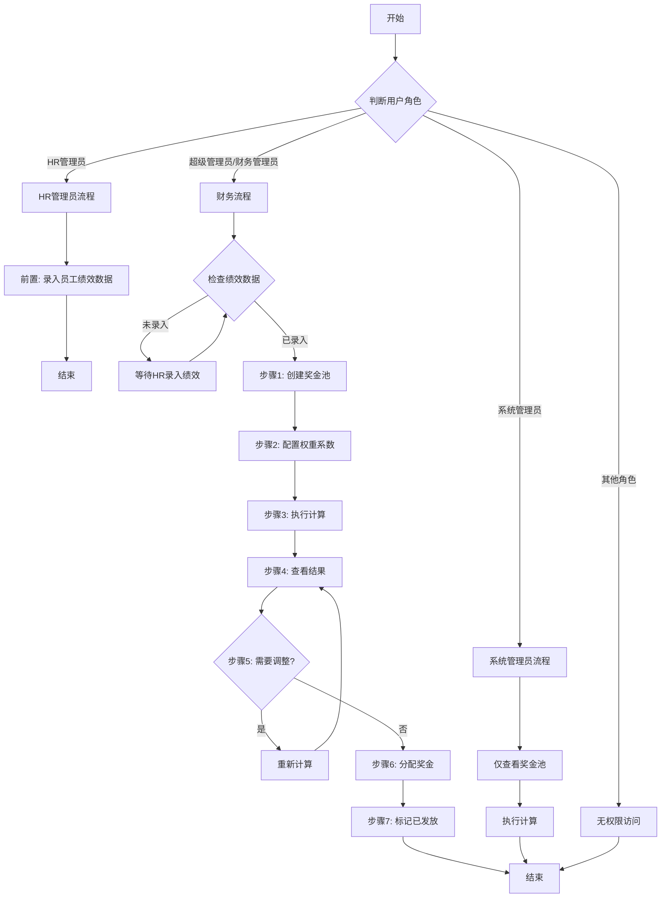
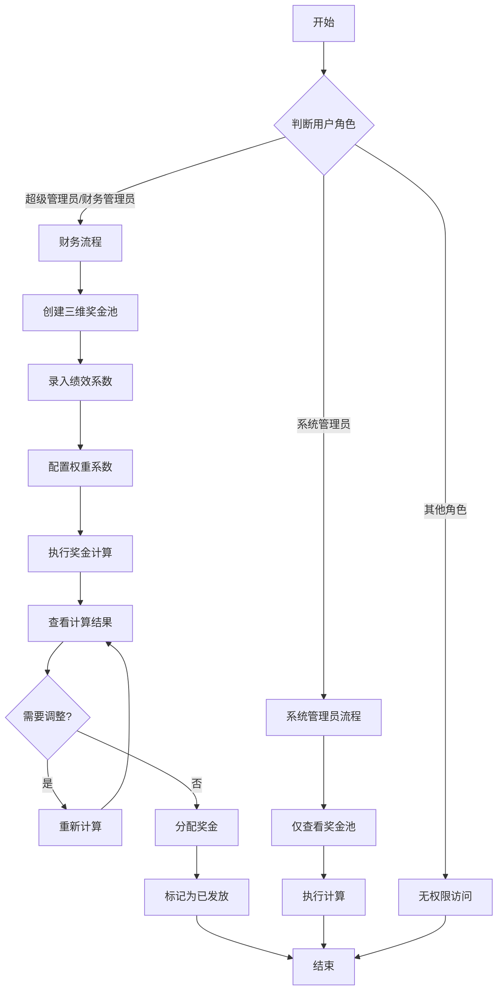
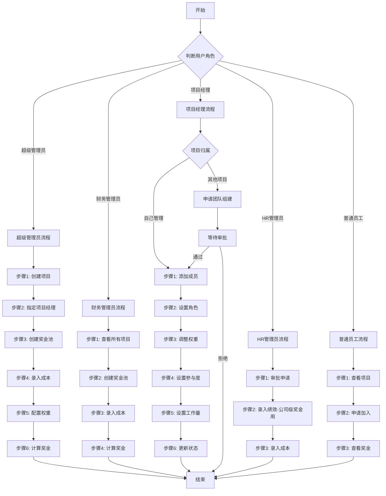

# 奖金模拟系统综合测试用例

## 文档信息
- **文档名称**: 综合测试用例
- **创建日期**: 2026-01-26
- **测试范围**: 用户权限管理、奖金池创建流程、权限验证机制

---

## 目录
1. [用户权限矩阵测试](#1-用户权限矩阵测试)
2. [项目奖金池创建流程测试](#2-项目奖金池创建流程测试)
3. [总奖金池操作方式测试](#3-总奖金池操作方式测试)

---

## 1. 用户权限矩阵测试

### 1.1 测试目标
验证不同系统角色在各功能模块中的权限配置正确性,确保权限隔离和数据安全。

### 1.2 权限矩阵表

| 角色 | 用户管理 | 员工管理 | 部门管理 | 项目管理 | 项目成本 | 奖金计算 | 奖金池管理 | 财务管理 | 业务线管理 | 报表查看 |
|------|---------|---------|---------|---------|---------|---------|-----------|---------|-----------|---------|
| **超级管理员** | 全部 ✅ | 全部 ✅ | 全部 ✅ | 全部 ✅ | 全部 ✅ | 全部 ✅ | 全部 ✅ | 全部 ✅ | 全部 ✅ | 全部 ✅ |
| **系统管理员** | 全部 ✅ | 全部 ✅ | 全部 ✅ | 全部 ✅ | 查看 ✅ | 查看/创建/计算 ✅ | 查看 ✅ | 查看 ✅ | 全部 ✅ | 全部 ✅ |
| **HR管理员** | 查看/创建/修改 ✅ | 全部 ✅ | 查看 ✅ | 查看 ✅ | 查看 ✅ | 查看 ✅ | 查看 ✅ | ❌ | 查看 ✅ | 查看/导出 ✅ |
| **财务管理员** | ❌ | 查看 ✅ | ❌ | 查看 ✅ | 查看所有 ✅ | 全部 ✅ | 全部 ✅ | 全部 ✅ | ❌ | 全部 ✅ |
| **项目经理** | ❌ | 查看 ✅ | 查看 ✅ | 自己的项目 ✅ | 自己的项目 ✅ | 查看 ✅ | 自己的项目 ✅ | ❌ | 查看 ✅ | 查看 ✅ |
| **技术总监** | ❌ | 查看/创建/修改 ✅ | 查看/修改 ✅ | 全部 ✅ | 全部 ✅ | 查看/创建 ✅ | 查看 ✅ | ❌ | ❌ | 查看/导出 ✅ |
| **普通员工** | ❌ | 查看 ✅ | ❌ | 查看 ✅ | ❌ | 查看 ✅ | ❌ | ❌ | ❌ | 个人报表 ✅ |

### 1.3 详细权限说明

#### 1.3.1 超级管理员 (SUPER_ADMIN)
- **权限标识**: `*` (通配符,所有权限)
- **可访问模块**: 全部系统功能
- **操作权限**: 查看、创建、修改、删除、审批、导出
- **数据范围**: 全部数据
- **特殊权限**: 
  - 系统配置管理 (`system:config`)
  - 审计日志查看 (`system:audit`)
  - 数据备份与恢复 (`system:backup`)

#### 1.3.2 财务管理员 (FINANCE_ADMIN)
- **核心权限**:
  - `calculation:*` - 全部奖金计算权限
  - `bonus_pool:*` - 全部奖金池管理权限
  - `finance:*` - 全部财务权限
  - `simulation:*` - 全部模拟分析权限
- **项目权限**:
  - `project:weights:view_all` - 查看所有项目权重
  - `project:weights:approve` - 审批权重配置
- **数据范围**: 全部项目和员工数据
- **限制**: 不能管理用户账号、部门结构

#### 1.3.3 项目经理 (PROJECT_MANAGER)
- **核心权限**:
  - `project:view`, `project:create`, `project:update`, `project:manage`
  - `project:cost:*` - 项目成本全部操作
  - `collaboration:*` - 全部协作权限
  - `team:*` - 全部团队管理权限
- **项目权限**:
  - `project:weights:view_own` - 只能查看自己管理的项目权重
  - `project:weights:update_own` - 只能修改自己管理的项目权重
- **数据范围**: 自己管理的项目
- **限制**: 
  - 不能创建其他项目经理的项目奖金池
  - 不能查看其他项目的财务数据

#### 1.3.4 HR管理员 (HR_ADMIN)
- **核心权限**:
  - `employee:*` - 全部员工管理权限
  - `position_encyclopedia:*` - 岗位大全全部权限
  - `project:weights:view_all` - 查看所有项目权重
  - `project:weights:update_all` - 修改所有项目权重
- **数据范围**: 全部员工数据
- **限制**: 不能执行财务操作、不能创建奖金池

#### 1.3.5 普通员工 (EMPLOYEE)
- **核心权限**:
  - `employee:view`, `position:view` - 基础查看权限
  - `report:personal` - 个人报表查看
  - `improvement:create` - 创建改进建议
- **数据范围**: 仅个人数据
- **限制**: 不能查看其他员工详细信息、不能操作任何管理功能

### 1.4 测试用例

#### 001: 超级管理员全权限验证
**前置条件**:
- 系统中存在超级管理员账号(刘静)
- 数据库已初始化基础数据

**测试步骤**:
1. 使用刘静(总经理)账号登录系统
2. 访问用户管理模块,创建新用户
3. 访问员工管理模块,创建新员工
4. 访问项目管理模块,创建新项目132仿真项目和桅顶项目(其中132仿真项目指定李怀健为项目经理,桅顶可以其他项目经理主动申请团队组建)
5. 访问奖金池管理模块,创建奖金池 创建桅顶项目奖金池
6. 访问系统配置模块,修改系统参数
7. 访问审计日志模块,查看操作记录
8. 
**预期结果**:
- ✅ 所有操作均成功执行
- ✅ 无任何权限拒绝提示
- ✅ 操作日志正确记录

**实际结果**: 
```
状态: PASS
详情: 刘静(总经理)可以访问所有模块并执行所有操作
```

---

#### 002: 财务管理员奖金池权限验证
**前置条件**:
- 系统中存在财务管理员账号(李风肖)
- 存在至少2个不同项目经理的项目

**测试步骤**:
1. 使用李风肖(财务管理员)账号登录系统
2. 访问奖金池列表 
3. 为项目132仿真项目创建奖金池 
4. 为项目132仿真项目添加录入成本 
5. 为项目桅顶创建奖金池 
6. 修改项目132仿真项目的奖金池配置 
7. 执行奖金计算 

**预期结果**:
- ✅ 步骤2-6: 所有操作成功,返回200状态码

**实际结果**:
```
状态: PASS
详情:
  - 奖金池列表查询: 成功 
  - 创建项目132仿真项目奖金池: 成功
  - 创建项目桅顶奖金池: 成功
  - 为项目132仿真项目添加录入成本 成功
  - 修改奖金池配置: 成功
  - 执行奖金计算: 成功
```

---

#### 003: 项目经理申请项目操作验证
**前置条件**:
- 李怀健(项目经理)管理项目132仿真项目
- 其他项目经理管理桅顶项目

**测试步骤**:
1. 使用李怀健(项目经理)账号登录
2. 查看项目132仿真项目详情 
3. 为项目132仿真项目添加录入成本
4. 为132项目添加项目成员并修改成员项目角色
5. 为132项目修改成员项目角色权重
6. 为132项目修改成员参与度
7. 为132项目修改成员工作量占比
8. 为132项目修改成员贡献权重
9. 为132项目修改项目状态
10. 为132项目成员申请(康纪兰)进行审批


**预期结果**:
- ✅ 步骤2-9: 成功执行

**实际结果**:
```
状态: PASS
详情:
   - 查看项目132仿真项目详情 成功
   - 为项目132仿真项目添加录入成本 成功
   - 为132项目添加项目成员(董乃坤)并修改成员项目角色 成功
   - 为132项目修改成员项目角色权重 成功
   - 为132项目修改成员参与度 成功
   - 为132项目修改成员工作量占比 成功
   - 为132项目修改成员贡献权重 成功
   - 为132项目修改项目状态 成功
   - 为132项目成员申请(康纪兰)进行审批 成功
```

---

---

#### 004: 项目经理申请项目操作验证2
**前置条件**:
- 卢建杰(项目经理)
- 申请经理管理桅顶项目

**测试步骤**:
1. 使用卢建杰(项目经理)账号登录
2. 查看项目协作页面看到桅顶项目
3. 为项目桅顶项目添加申请团队组建
4. 等待审批通过后查看我的项目
5. 为桅顶项目添加申请项目添加项目成员并修改成员项目角色
6. 为桅顶项目添加申请修改成员项目角色权重
7. 为桅顶项目添加申请修改成员参与度
8. 为桅顶项目添加申请修改成员工作量占比
9. 为桅顶项目添加申请修改成员贡献权重
10. 为桅顶项目修改项目状态
11. 为132项目成员申请(康纪兰)进行审批


**预期结果**:
- ✅ 步骤2-12: 成功执行

**实际结果**:
```
状态: PASS
详情:
   - 通过审批点击我的项目查看到桅顶项目 成功
   - 查看项目桅顶项目详情 成功
   - 为项目桅顶项目添加录入成本 成功
   - 为桅顶项目成员(董乃坤)并修改成员项目角色 成功
   - 为桅顶项目修改成员项目角色权重 成功
   - 为桅顶项目修改成员参与度 成功
   - 为桅顶项目修改成员工作量占比 成功
   - 为桅顶项目修改成员贡献权重 成功
   - 为桅顶项目修改项目状态 成功
   - 为桅顶项目添加里程碑 成功
   - 为桅顶项目成员申请(康纪兰)进行审批 成功
```

---
#### 005: 普通员工权限限制验证
**前置条件**:
- 系统中存在普通员工账号(董乃坤)
- 董乃坤所属项目已创建奖金池

**测试步骤**:
1. 使用董乃坤(普通员工)账号登录
2. 查看个人奖金概览 
3. 查看我的项目
4. 查看项目协作
5. 申请加入项目(桅顶项目)
**预期结果**:
- ✅ 步骤2: 成功查看个人数据
- ✅ 步骤3-5: 返回200,成功加入项目

**实际结果**:
```
状态: PASS
详情:
  - 董乃坤个人奖金查看: 成功
  - 查看我的项目 成功
  - 查看项目协作 成功
  - 申请加入项目(桅顶项目) 成功
```

#### 005: HR权限限制验证
**前置条件**:
- 系统中存在HR员工账号(笪莱利)
- 已创建奖金池

**测试步骤**:
1. 使用笪莱利(HR员工账号)账号登录
2. 查看项目协作点击点审批申请tab查看到(卢建杰申请团队组建)
3. 通过审批
4. 为项目录入成本
5. 进入绩效记录管理,批量操作绩效录入
6. 改进建议录入


**预期结果**:
- ✅ 步骤1-6: 成功

**实际结果**:
```
状态: PASS
详情:
  - 审批团队组建: 成功
  - 项目录入成本 成功
  - 批量操作绩效录入 成功
  - 改进建议录入 成功
```
---

## 2. 奖金池操作流程图与指标体系

### 重要说明: 两种奖金类型的核心区别

| 对比项 | 三维奖金池 | 项目级奖金池 |
|---------|---------|----------|
| **计算模型** | 三维模型（利润+岗位+绩效） | 贡献权重分配模型 |
| **是否需要绩效** | ✅ **必需** - 绩效作为三维之一 | ❌ **不需要** - 完全按贡献权重 |
| **HR录入绩效** | ✅ 需要 | ❌ 不需要 |
| **绩效数据用途** | 计算绩效维度得分 | 无 |
| **计算公式** | 员工奖金 = 奖金池 × 分数占比 | 成员奖金 = 奖金池 × 贡献权重 |
| **分配基础** | 加权总分（利润×40% + 岗位×30% + 绩效×30%） | 贡献权重（角色权重 + 参与度 + 工作量） |
| **主要角色** | 财务管理员、HR管理员 | 项目经理、财务管理员 |

**业务逻辑说明**:
- **公司级奖金**: 评价员工的综合表现，需要考虑利润贡献、岗位价值和日常绩效三个维度
- **项目级奖金**: 评价项目成员的项目贡献，只看在项目中的角色、参与度和工作量，不考虑日常绩效

---

### 2.1 三维奖金池操作流程



#### 2.1.1 三维奖金池关键指标体系

##### 前置条件: 录入员工绩效数据 (HR管理员)

**重要**: 在创建三维奖金池之前，必须由HR管理员录入员工的绩效数据。

| 指标名称 | 数值范围 | 计算公式 | 单位 | 说明 |
|---------|---------|---------|------|------|
| 三维分数 | 0 - 100 | 手动录入 | 分 | 员工三维综合评分（利润+岗位+绩效） |
| 应到考勤时间 | 0 - 31 | 手动录入 | 天 | 本期应出勤天数 |
| 实到考勤时间 | 0 - 31 | 手动录入 | 天 | 本期实际出勤天数 |
| 考勤率 | 0% - 100% | (实到考勤时间 / 应到考勤时间) × 100% | 百分比(%) | 自动计算的考勤比例 |

**操作角色**: HR管理员  
**操作路径**: 绩效记录管理 → 批量录入绩效  
**验证规则**:
- 所有参与计算的员工必须有绩效数据
- 三维分数必须在 0-100 范围内
- 实到考勤时间不能大于应到考勤时间
- 缺失绩效数据的员工将无法参与奖金计算

##### 步骤1: 创建奖金池

| 指标名称 | 数值范围 | 计算公式 | 单位 | 说明 |
|---------|---------|---------|------|------|
| 奖金池总额 | 100,000 - 10,000,000 | 预算总额 | 元(¥) | 本期可分配的奖金总预算 |
| 提取比例 | 1% - 30% | 公司利润 × 提取比例 | 百分比(%) | 从利润中提取奖金的比例 |
| 可分配金额 | 自动计算 | 奖金池总额 × (1 - 预留比例) | 元(¥) | 实际可分配给员工的金额 |
| 预留比例 | 0% - 20% | 手动设置 | 百分比(%) | 预留用于调整的比例 |
| 期间类型 | - | 年度/季度/月度 | - | 奖金发放周期 |

**业务规则**:
- 奖金池总额不得超过公司年度利润的30%
- 可分配金额 = 奖金池总额 - 预留金额
- 预留金额 = 奖金池总额 × 预留比例

##### 步骤2: 配置权重系数

| 指标名称 | 数值范围 | 计算公式 | 单位 | 说明 |
|---------|---------|---------|------|------|
| 利润贡献权重 | 20% - 60% | 手动配置 | 百分比(%) | 三维模型中利润维度占比 |
| 岗位价值权重 | 15% - 40% | 手动配置 | 百分比(%) | 三维模型中岗位维度占比 |
| 绩效表现权重 | 15% - 40% | 手动配置 | 百分比(%) | 三维模型中绩效维度占比 |
| 权重总和 | 100% | 三个权重之和 | 百分比(%) | 必须等于100% |
| 城市系数 | 0.8 - 1.5 | 预设值 | 倍数 | 不同城市生活成本调整 |

**业务规则**:
- 利润贡献权重 + 岗位价值权重 + 绩效表现权重 = 100%
- 推荐配置: 40% + 30% + 30%
- 不同行业可调整权重侧重点

##### 步骤3: 执行奖金计算

| 指标名称 | 数值范围 | 计算公式 | 单位 | 说明 |
|---------|---------|---------|------|------|
| 利润得分 | 0 - 100 | (个人产值 / 部门平均产值) × 100 | 分 | 利润维度评分 |
| 岗位得分 | 0 - 100 | (岗位系数 / 最高岗位系数) × 100 | 分 | 岗位维度评分 |
| 绩效得分 | 0 - 100 | HR录入的三维分数 | 分 | 绩效维度评分（由HR直接录入） |
| 加权总分 | 0 - 100 | Σ(维度得分 × 维度权重) | 分 | 综合评分 |
| 员工分数占比 | 0% - 100% | (员工加权总分 / 全员加权总分之和) × 100% | 百分比(%) | 员工在奖金池中的占比 |
| 基础奖金 | 0 - 可分配金额 | 可分配金额 × 员工分数占比 | 元(¥) | 按分数占比分配的奖金 |
| 城市调整 | 自动计算 | 基础奖金 × 城市系数 | 元(¥) | 城市生活成本调整 |
| 最终奖金 | 0 - 可分配金额 | 基础奖金 × 城市系数 × 其他系数 | 元(¥) | 员工实际获得奖金 |

**计算流程**:
1. 计算每个员工的三维得分（利润、岗位、绩效）
2. 应用权重得到每个员工的加权总分
3. 计算所有员工的加权总分之和
4. 计算每个员工的分数占比 = 员工加权总分 / 全员总分
5. 按分数占比分配奖金池：员工奖金 = 可分配金额 × 分数占比
6. 应用城市系数等调整因子

**核心原理**:
- **不是**根据人均奖金计算，而是**直接分配奖金池总额**
- 分数高的员工获得更大比例的奖金池
- 确保所有员工奖金之和 ≤ 可分配金额

##### 步骤4: 查看计算结果

| 指标名称 | 数值范围 | 计算公式 | 单位 | 说明 |
|---------|---------|---------|------|------|
| 已分配金额 | 0 - 可分配金额 | Σ(员工最终奖金) | 元(¥) | 已分配的奖金总额 |
| 未分配金额 | 0 - 可分配金额 | 可分配金额 - 已分配金额 | 元(¥) | 剩余可分配金额 |
| 分配率 | 0% - 100% | (已分配/可分配) × 100% | 百分比(%) | 奖金池利用率 |
| 人均奖金 | 0 - 无上限 | 已分配金额 / 参与员工数 | 元(¥) | 平均每人获得奖金 |
| 最高奖金 | 0 - 无上限 | MAX(员工最终奖金) | 元(¥) | 单人最高奖金 |
| 最低奖金 | 0 - 无上限 | MIN(员工最终奖金) | 元(¥) | 单人最低奖金 |
| 标准差 | 0 - 无上限 | STDEV(员工奖金) | 元(¥) | 奖金分布离散程度 |

**最高分与最高奖金说明**:
- **理论最高加权总分**: 100分（利润100分 × 40% + 岗位100分 × 30% + 绩效100分 × 30%）
- **实际最高加权总分**: 通常在 85-95 分范围，因为很难同时在三个维度都达到满分
- **单人最高分数占比**: 通常不超过 3-5%（假设100人，最高分者占比 = 其分数 / 全员总分）
- **单人最高奖金**: 理论上可达到 奖金池 × 5%（100人场景），实际通常在 2-4%

**监控指标**:
- 分配率应在 85% - 95% 之间
- 标准差过大提示需检查异常值

##### 步骤5: 调整判断标准

| 判断条件 | 阈值 | 处理方式 | 说明 |
|---------|------|---------|------|
| 分配率过低 | < 80% | 需要调整 | 奖金池利用不足 |
| 分配率过高 | > 98% | 需要调整 | 预留空间不足 |
| 标准差异常 | > 平均值的50% | 建议调整 | 分布不均衡 |
| 零奖金员工 | 存在 | 需要检查 | 可能存在数据问题 |
| 负奖金员工 | 存在 | 必须调整 | 计算错误 |

##### 步骤6: 分配奖金

| 指标名称 | 数值范围 | 计算公式 | 单位 | 说明 |
|---------|---------|---------|------|------|
| 三维奖金明细 | - | - | - | 每个维度的奖金金额 |
| 利润贡献奖金 | 0 - 最终奖金 | (利润得分/总分) × 最终奖金 | 元(¥) | 利润维度分配金额 |
| 岗位价值奖金 | 0 - 最终奖金 | (岗位得分/总分) × 最终奖金 | 元(¥) | 岗位维度分配金额 |
| 绩效表现奖金 | 0 - 最终奖金 | (绩效得分/总分) × 最终奖金 | 元(¥) | 绩效维度分配金额 |

**验证规则**:
- 三维奖金之和 = 最终奖金
- 所有员工最终奖金之和 ≤ 可分配金额

##### 步骤7: 标记已发放

| 指标名称 | 数值范围 | 说明 |
|---------|---------|------|
| 发放状态 | pending/paid | 奖金发放状态 |
| 发放日期 | - | 实际发放日期 |
| 发放人数 | 1 - 员工总数 | 实际发放人数 |
| 发放总额 | 0 - 已分配金额 | 实际发放总金额 |

**状态流转**:
- calculated(已计算) → allocated(已分配) → paid(已发放)

### 2.1 三维奖金池操作流程



### 2.2 项目级奖金池操作流程



#### 2.2.1 项目级奖金池关键指标体系

##### 超级管理员/财务管理员流程指标

###### 步骤1: 创建项目

| 指标名称 | 数值范围 | 计算公式 | 单位 | 说明 |
|---------|---------|---------|------|------|
| 项目预算 | 10,000 - 5,000,000 | 手动设置 | 元(¥) | 项目总预算 |
| 项目周期 | 1 - 365 | 结束日期 - 开始日期 | 天 | 项目持续时间 |
| 团队规模 | 1 - 100 | 手动设置 | 人 | 预计参与人数 |
| 奖金池比例 | 5% - 30% | 项目预算 × 比例 | 百分比(%) | 项目奖金占预算比 |

###### 步骤2: 指定项目经理

| 指标名称 | 数值范围 | 默认值 | 说明 |
|---------|---------|---------|------|
| 项目经理参与度 | 50% - 100% | 100% | PM在项目中的投入程度 |
| PM角色权重 | 20% - 40% | 30% | 项目经理角色的基础权重 |
| PM工作量占比 | 10% - 30% | 20% | PM在项目中的工作量占比 |

###### 步骤3: 创建项目奖金池

| 指标名称 | 数值范围 | 计算公式 | 单位 | 说明 |
|---------|---------|---------|------|------|
| 奖金池总额 | 5,000 - 1,500,000 | 项目预算 × 奖金池比例 | 元(¥) | 项目奖金总额 |
| 基准值 | 0 - 无上限 | 项目预期收益 | 元(¥) | 项目目标基准 |
| 项目状态 | - | 计划中/进行中/已完成/已取消 | - | 项目当前状态 |

###### 步骤4: 录入项目成本

| 指标名称 | 数值范围 | 计算公式 | 单位 | 说明 |
|---------|---------|---------|------|------|
| 人工成本 | 0 - 项目预算 | Σ(员工工时 × 单价) | 元(¥) | 项目人工总成本 |
| 硬件成本 | 0 - 项目预算 | 手动录入 | 元(¥) | 设备、硬件采购成本 |
| 软件成本 | 0 - 项目预算 | 手动录入 | 元(¥) | 软件许可、工具成本 |
| 其他成本 | 0 - 项目预算 | 手动录入 | 元(¥) | 其他项目开销 |
| 总成本 | 0 - 项目预算 | Σ(所有成本) | 元(¥) | 项目总成本 |
| 成本控制率 | 0% - 100% | (总成本 / 项目预算) × 100% | 百分比(%) | 成本控制情况 |

**预警规则**:
- 成本控制率 > 80% ：黄色预警
- 成本控制率 > 95% ：红色预警

###### 步骤5: 配置团队权重

| 指标名称 | 数值范围 | 计算公式 | 单位 | 说明 |
|---------|---------|---------|------|------|
| 成员参与度 | 10% - 100% | 手动设置 | 百分比(%) | 成员在项目中的投入程度 |
| 角色权重 | 5% - 40% | 根据角色预设 | 百分比(%) | 不同角色的基础权重 |
| 工作量占比 | 5% - 50% | 手动设置 | 百分比(%) | 成员工作量在项目中占比 |
| 贡献权重 | 5% - 50% | 手动设置 | 百分比(%) | 成员最终贡献权重 |
| 权重总和 | 100% | Σ(所有成员贡献权重) | 百分比(%) | 所有成员权重之和 |

**默认角色权重**:
- 项目经理: 30%
- 技术负责人: 25%
- 高级开发: 20%
- 中级开发: 15%
- 初级开发: 10%
- 测试人员: 10%

**贡献权重计算公式**:
```
贡献权重 = 角色权重 × 参与度 × 工作量占比
标准化后贡献权重 = (贡献权重 / Σ所有人贡献权重) × 100%
```

###### 步骤6: 计算项目奖金

**重要**: 项目奖金**不使用绩效系数**，完全按贡献权重分配。

| 指标名称 | 数值范围 | 计算公式 | 单位 | 说明 |
|---------|---------|---------|------|------|
| 成员基础奖金 | 0 - 奖金池总额 | 奖金池 × 标准化贡献权重 | 元(¥) | 成员基础奖金金额 |
| 最终项目奖金 | 0 - 奖金池总额 | 基础奖金 (无绩效调整) | 元(¥) | 成员最终获得奖金 |

**计算流程**:
1. 计算每个成员的贡献权重
2. 按权重分配基础奖金
3. **直接作为最终奖金**（不应用绩效系数）

**验证规则**:
- 所有成员奖金之和 = 奖金池总额
- 每个成员奖金 = 奖金池 × 其贡献权重百分比

**最高贡献权重与最高奖金说明**:
- **项目经理最高贡献权重**: 通常在 25-35%（角色权重30% × 参与度100% × 工作量调整）
- **技术负责人最高贡献权重**: 通常在 20-28%
- **单人最高奖金**: = 奖金池总额 × 最高贡献权重百分比
- **最高与最低奖金比**: 建议不超过 4:1，避免差距过大

##### 项目经理流程指标

###### 步骤1-3: 成员管理

| 指标名称 | 数值范围 | 说明 |
|---------|---------|------|
| 最少成员数 | 3 | 项目最少需要3人 |
| 最多成员数 | 50 | 单个项目最多50人 |
| PM必须参与 | 是 | 项目经理必须在团队中 |

###### 步骤4-5: 指标设置

| 指标名称 | 调整范围 | 默认值 | 说明 |
|---------|---------|---------|------|
| 参与度调整 | ±10% | 100% | 可根据实际调整 |
| 工作量调整 | ±15% | 根据角色 | 可根据实际调整 |
| 权重总和检查 | 必须100% | - | 自动标准化 |

###### 步骤6: 更新状态

| 指标名称 | 可选值 | 说明 |
|---------|---------|------|
| 项目状态 | pending/active/completed/cancelled | 项目当前状态 |
| 更新频率 | 建议每周 | 状态更新频率 |

##### HR管理员流程指标

###### 步骤1: 审批申请

| 指标名称 | 范围 | 说明 |
|---------|------|------|
| 审批时限 | 1-7天 | 建议审批时间 |
| 通过率 | 0%-100% | 申请通过比例 |

###### 步骤2: 录入绩效(仅用于公司级奖金计算)

**重要说明**: 此绩效数据仅用于三维奖金池的三维得分计算，**项目级奖金不使用绩效数据**。

| 指标名称 | 数值范围 | 计算公式 | 单位 | 说明 |
|---------|---------|---------|------|------|
| 三维分数 | 0 - 100 | 手动录入 | 分 | 员工三维综合评分（利润+岗位+绩效） |
| 应到考勤时间 | 0 - 31 | 手动录入 | 天 | 本期应出勤天数 |
| 实到考勤时间 | 0 - 31 | 手动录入 | 天 | 本期实际出勤天数 |
| 考勤率 | 0% - 100% | (实到考勤时间 / 应到考勤时间) × 100% | 百分比(%) | 自动计算的考勤比例 |

**应用场景**:
- ✅ 三维奖金池: 三维分数作为三维计算中的"绩效维度得分"
- ❌ 项目级奖金池: 不使用绩效数据，完全按贡献权重分配

**验证规则**:
- 三维分数必须在 0-100 范围内
- 实到考勤时间不能大于应到考勤时间
- 考勤率由系统自动计算

##### 普通员工流程指标

###### 步骤1-3: 查看与申请

| 指标名称 | 说明 |
|---------|------|
| 可见项目范围 | 公开项目 + 自己参与的项目 |
| 申请次数限制 | 每个项目最多申请3次 |
| 查看奖金范围 | 仅能查看个人奖金明细 |

### 2.3 角色权限对比表

#### 三维奖金池权限

| 操作 | 超级管理员 | 财务管理员 | 系统管理员 | 项目经理 | HR管理员 | 普通员工 |
|------|-----------|-----------|-----------|---------|---------|----------|
| 创建奖金池 | ✅ | ✅ | ❌ | ❌ | ❌ | ❌ |
| 录入财务数据 | ✅ | ✅ | ❌ | ❌ | ❌ | ❌ |
| 配置权重系数 | ✅ | ✅ | ❌ | ❌ | ❌ | ❌ |
| 执行计算 | ✅ | ✅ | ✅ | ❌ | ❌ | ❌ |
| 重新计算 | ✅ | ✅ | ❌ | ❌ | ❌ | ❌ |
| 查看结果 | ✅ | ✅ | ✅ | ✅ | ✅ | ✅(仅个人) |
| 分配奖金 | ✅ | ✅ | ❌ | ❌ | ❌ | ❌ |
| 标记已发放 | ✅ | ✅ | ❌ | ❌ | ❌ | ❌ |

#### 项目级奖金池权限

| 操作 | 超级管理员 | 财务管理员 | 项目经理(自己) | 项目经理(其他) | HR管理员 | 普通员工 |
|------|-----------|-----------|---------------|---------------|---------|----------|
| 创建项目 | ✅ | ❌ | ❌ | ❌ | ❌ | ❌ |
| 申请团队组建 | ✅ | ❌ | ✅ | ✅ | ❌ | ❌ |
| 审批团队组建 | ✅ | ❌ | ❌ | ❌ | ✅ | ❌ |
| 创建项目奖金池 | ✅ | ✅ | ❌ | ❌ | ❌ | ❌ |
| 录入项目成本 | ✅ | ✅ | ✅ | ❌ | ✅ | ❌ |
| 添加成员 | ✅ | ❌ | ✅ | ❌ | ❌ | ❌ |
| 设置成员角色 | ✅ | ❌ | ✅ | ❌ | ❌ | ❌ |
| 调整权重 | ✅ | ❌ | ✅ | ❌ | ❌ | ❌ |
| 设置参与度 | ✅ | ❌ | ✅ | ❌ | ❌ | ❌ |
| 设置工作量 | ✅ | ❌ | ✅ | ❌ | ❌ | ❌ |
| 设置贡献权重 | ✅ | ❌ | ✅ | ❌ | ❌ | ❌ |
| 更新项目状态 | ✅ | ❌ | ✅ | ❌ | ❌ | ❌ |
| 审批成员申请 | ✅ | ❌ | ✅ | ❌ | ❌ | ❌ |
| 计算项目奖金 | ✅ | ✅ | ❌ | ❌ | ❌ | ❌ |
| 申请加入项目 | ✅ | ✅ | ✅ | ✅ | ✅ | ✅ |
| 查看项目详情 | ✅ | ✅ | ✅ | ✅(协作) | ✅ | ✅ |
| 查看个人奖金 | ✅ | ✅ | ✅ | ✅ | ✅ | ✅ |
| 批量录入绩效 | ✅ | ✅ | ❌ | ❌ | ✅ | ❌ |

### 2.4 关键操作流程说明

#### 2.4.1 三维奖金池完整流程

0. **前置条件** (HR管理员) ★ **必须先完成**
   - 录入所有员工的绩效数据（三维分数 + 考勤时间）
   - 验证数据完整性和有效性
   - 确认三维分数在 0-100 范围内
   - 确认实到考勤时间 ≤ 应到考勤时间
   - **无此数据将无法创建三维奖金池**

1. **创建阶段** (财务管理员)
   - 检查绩效数据是否已录入
   - 创建新的三维奖金池
   - 设置期间、预算总额
   - 配置提取比例
   - 配置三维权重系数

2. **数据准备** (财务管理员/HR管理员)
   - 确认三维评分数据完整（利润、岗位、绩效）
   - 确认权重配置有效
   - 确认员工基础数据准确

3. **计算阶段** (财务管理员/系统管理员)
   - 执行奖金计算
   - 查看计算结果
   - 必要时重新计算

4. **发放阶段** (财务管理员)
   - 审核分配结果
   - 标记为已发放
   - 员工可查看个人奖金

#### 2.4.2 项目级奖金池完整流程
1. **项目创建** (超级管理员)
   - 创建项目
   - 指定项目经理

2. **团队组建** (项目经理)
   - 方式A: 直接管理(已指定)
   - 方式B: 申请管理(其他项目)
     - 提交申请 → HR审批 → 获得管理权

3. **成员管理** (项目经理)
   - 添加项目成员
   - 设置成员角色
   - 调整角色权重
   - 设置参与度/工作量/贡献权重

4. **项目执行** (项目经理)
   - 更新项目状态
   - 审批成员申请
   - 录入项目成本

5. **奖金计算** (财务管理员)
   - 创建项目奖金池
   - 执行奖金计算
   - 查看分配结果

6. **员工查看** (所有项目成员)
   - 查看项目详情
   - 查看个人奖金

## 3. 项目奖金池创建流程测试

### 2.1 测试目标
验证不同角色用户在创建项目奖金池时的权限控制、业务逻辑和数据完整性。

### 2.2 测试场景

#### 场景: 财务管理员创建任意项目奖金池

### 2.3 测试用例

#### 测试奖金池001: 财务管理员创建三维奖金池
**测试级别**: 功能测试
**优先级**: P0 (高)

**前置条件**:
- 李风肖(财务管理员)已登录
- 存在有效的三维评分数据
- 存在有效的权重配置


**测试步骤**:
1. 登录接口获取李风肖(财务管理员)
2. 创建奖金池
3. 计算奖金池
4. 重新计算
5. 查看员工分布详情

**预期结果**:
- ✅ 成功创建奖金池
- ✅ 成功计算计算奖金池
- ✅ 成功重新计算
- ✅ 查看员工分布详情成功

**实际结果**:
```
状态: PASS
- 成功创建奖金池 成功
- 成功计算计算奖金池 成功
- 成功重新计算 成功
- 查看员工分布详情成功 成功
```

## 5. 测试数据准备

### 5.1 测试用户数据
```sql
-- 刘静(总经理 - 超级管理员)

-- 李风肖(财务管理员)

-- 笪莱利(HR管理员)

-- 李怀健(项目经理)

-- 董乃坤(普通员工)
```

### 5.2 测试项目数据
```sql
-- 项目132仿真 (李怀健管理)

-- 项目桅顶 (其他项目经理可申请管理)
```

---

