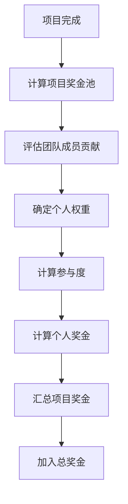
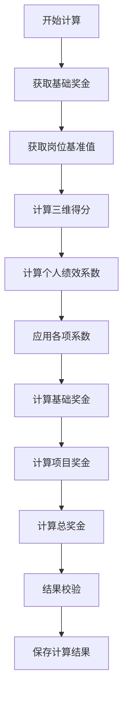

# 奖金计算方法说明文档

## 文档信息
- **文档版本**: v1.0
- **创建日期**: 2025-11-07
- **最后更新**: 2025-11-07
- **文档类型**: 系统设计说明
- **系统名称**: 奖金分配系统

---

## 📋 目录
1. [奖金计算模型概述](#1-奖金计算模型概述)
2. [三维奖金计算模型](#2-三维奖金计算模型)
3. [项目奖金分配机制](#3-项目奖金分配机制)
4. [岗位基准值体系](#4-岗位基准值体系)
5. [奖金计算流程](#5-奖金计算流程)
6. [数据库表设计](#6-数据库表设计)
7. [API接口设计](#7-api接口设计)
8. [实际计算示例](#8-实际计算示例)
9. [常见问题解答](#9-常见问题解答)

---

## 1. 奖金计算模型概述

### 1.1 设计理念
本系统采用**"三维奖金模型 + 项目奖金机制"**的混合分配体系，结合岗位基准值和个人绩效，实现公平、透明、激励性的奖金分配。

### 1.2 核心组成
```
总奖金 = 基础奖金 + 项目奖金
       = (基础奖金 × 岗位基准值 × 个人绩效系数 × 业务线系数 × 城市系数 × 时间系数) + 项目奖金
```
```
个人奖金 = 奖金池/ (三维计算得分 × 岗位基准值 × 个人绩效系数 × 业务线系数 × 城市系数 × 时间系数)
```
### 1.3 关键参数
- **岗位基准值**: 0.1-3.0，反映岗位价值和重要性
- **个人绩效系数**: 0.5-2.0，基于三维评分计算
- **业务线系数**: 0.8-1.5，不同业务线的差异调整
- **城市系数**: 0.8-1.3，地区生活成本差异调整
- **时间系数**: 0.9-1.2，工作时间占比调整 (时间系数从绩效导入,然后自动计算)

---

## 2. 三维奖金计算模型

### 2.1 模型架构
三维奖金模型从三个维度全面评估员工贡献：

```
利润贡献维度 (40%)
├─ 直接贡献 (40%)
├─ 工作量贡献 (30%)
├─ 质量贡献 (20%)
└─ 岗位价值贡献 (10%)

岗位价值维度 (30%)
├─ 技能复杂度 (30%)
├─ 责任权重 (25%)
├─ 决策影响 (20%)
├─ 经验要求 (15%)
└─ 市场价值 (10%)

绩效表现维度 (30%)
├─ 工作产出 (35%)
├─ 工作质量 (30%)
├─ 工作效率 (15%)
├─ 团队协作 (10%)
├─ 创新能力 (5%)
├─ 领导能力 (3%)
└─ 学习成长 (2%)
```

### 2.2 各维度详细说明

#### 2.2.1 利润贡献维度 (权重: 40%)
- **直接贡献 (40%)**:
  - 直接创造的业务收入
  - 客户订单获取
  - 合同签署贡献
  - 计算方式: 直接收入金额 × 贡献率

- **工作量贡献 (30%)**:
  - 完成工作量的量化评估
  - 工时统计
  - 任务完成数量
  - 计算方式: 完成工时 ÷ 标准工时 × 100%

- **质量贡献 (20%)**:
  - 工作成果质量评价
  - 错误率、返工率
  - 客户满意度
  - 计算方式: 100% - 错误率 × 系数

- **岗位价值贡献 (10%)**:
  - 岗位固有价值
  - 不可替代性
  - 关键技能稀缺性
  - 计算方式: 岗位价值评分 × 权重

#### 2.2.2 岗位价值维度 (权重: 30%)
- **技能复杂度 (30%)**:
  - 技术难度评估
  - 所需专业技能数量
  - 学习成本评估
  - 评分标准: 1-10分

- **责任权重 (25%)**:
  - 承担的责任范围
  - 决策权限级别
  - 风险承担程度
  - 评分标准: 1-10分

- **决策影响 (20%)**:
  - 对组织的影响范围
  - 决策传播深度
  - 战略重要性
  - 评分标准: 1-10分

- **经验要求 (15%)**:
  - 工作经验要求
  - 行业经验要求
  - 特定领域经验
  - 评分标准: 1-10分

- **市场价值 (10%)**:
  - 外部市场薪资水平
  - 人才稀缺程度
  - 行业竞争力
  - 评分标准: 1-10分

#### 2.2.3 绩效表现维度 (权重: 30%)
- **工作产出 (35%)**:
  - 完成工作量
  - 交付成果数量
  - 目标达成率
  - 评分标准: 0-100分

- **工作质量 (30%)**:
  - 成果质量评级
  - 错误率统计
  - 客户反馈评分
  - 评分标准: 0-100分

- **工作效率 (15%)**:
  - 任务完成速度
  - 时间管理能力
  - 资源利用效率
  - 评分标准: 0-100分

- **团队协作 (10%)**:
  - 跨部门合作
  - 知识分享贡献
  - 团队氛围贡献
  - 评分标准: 0-100分

- **创新能力 (5%)**:
  - 创新方案提出
  - 流程优化建议
  - 技术创新应用
  - 评分标准: 0-100分

- **领导能力 (3%)**:
  - 项目领导表现
  - 团队指导能力
  - 影响力建设
  - 评分标准: 0-100分

- **学习成长 (2%)**:
  - 技能提升速度
  - 培训参与度
  - 知识更新频率
  - 评分标准: 0-100分

### 2.3 维度得分计算公式

#### 2.3.1 综合维度得分
```
维度得分 = Σ(子项目得分 × 子项目权重) × 维度权重
```

#### 2.3.2 三维综合得分
```
三维综合得分 = (利润贡献得分 × 40%) + (岗位价值得分 × 30%) + (绩效表现得分 × 30%)
```

#### 2.3.3 个人绩效系数转换
```
个人绩效系数 = 三维综合得分 ÷ 100
范围: 0.5 - 2.0
```

### 2.4 得分标准化

#### 2.4.1 百分位排名
```javascript
// 计算百分位排名
percentile = (rank - 1) ÷ (total_count - 1) × 100

// 示例: 总人数100，排名12
percentile = (12 - 1) ÷ (100 - 1) × 100 = 11.11%
```

#### 2.4.2 分层分配
```
优秀层 (90分以上): 最高级别奖金
良好层 (80-89分): 标准奖金
合格层 (70-79分): 基础奖金
待改进层 (60-69分): 保底奖金
```

---

## 3. 项目奖金分配机制

### 3.1 项目奖金池管理

#### 3.1.1 奖金池创建
- **预算依据**: 基于项目总预算的5-15%
- **重要性系数**: 根据项目战略重要性调整 (0.5-2.0)
- **难度系数**: 根据项目技术难度调整 (0.8-1.5)
- **团队规模**: 根据参与人数调整

```
项目奖金池 = 项目预算 × 5% × 重要性系数 × 难度系数 × 团队规模系数
```

#### 3.1.2 奖金池分配矩阵
| 项目优先级 | 团队人数 | 奖金池比例 | 最低奖金池 | 最高奖金池 |
|-----------|---------|-----------|-----------|-----------|
| 核心项目 | 3-5人 | 12-15% | ¥50,000 | ¥200,000 |
| 核心项目 | 6-10人 | 10-12% | ¥80,000 | ¥300,000 |
| 重要项目 | 3-5人 | 8-10% | ¥30,000 | ¥120,000 |
| 重要项目 | 6-10人 | 6-8% | ¥50,000 | ¥180,000 |
| 一般项目 | 3-5人 | 5-6% | ¥15,000 | ¥60,000 |
| 一般项目 | 6-10人 | 4-5% | ¥20,000 | ¥80,000 |

### 3.2 项目角色体系

#### 3.2.1 角色定义及权重
| 角色名称 | 基础权重范围 | 职责描述 | 典型岗位 |
|---------|-------------|---------|---------|
| 项目经理 | 1.2-1.5 | 项目整体协调，进度管理，风险控制 | 项目经理 |
| 技术负责人 | 1.1-1.3 | 技术架构设计，核心模块开发，技术攻关 | 高级工程师 |
| 高级开发 | 0.9-1.1 | 核心功能开发，代码审查，技术支持 | 高级工程师 |
| 普通开发 | 0.7-0.9 | 基础功能开发，单元测试，文档编写 | 中级/初级工程师 |
| 测试工程师 | 0.8-1.0 | 测试用例设计，自动化测试，质量保障 | QA工程师 |
| 需求分析师 | 0.9-1.1 | 需求分析，方案设计，客户沟通 | 需求分析师/产品经理 |

#### 3.2.2 权重计算公式
```
个人项目奖金 = 项目奖金池 × (个人权重 × 参与度) ÷ Σ(所有成员权重 × 参与度)

其中:
个人权重 = 角色基础权重 × 个人能力系数 × 贡献比例
参与度 = 实际参与时间 ÷ 项目总时间 (0.3-1.0)
```
```
个人权重 = 角色基础权重 × 个人能力系数 × 贡献权重 × 工作量占比 × 参与度
参与度范围：1-100%
工作量占比：1-100%（表示在该项目中投入的时间比例）
```
### 3.3 项目奖金计算流程



---

## 4. 岗位基准值体系

### 4.1 基准值定义
岗位基准值是一个0.1-3.0之间的数值，用于衡量岗位的相对价值和重要性，直接影响奖金倍数。

### 4.2 基准值分级

#### 4.2.1 高价值岗位 (1.8-3.0)
- **适用岗位**: CEO、技术总监、产品总监、高级管理
- **特点**: 高技能要求、高责任、高影响
- **示例**:
  - CEO/总经理: 2.5-3.0
  - 技术总监: 2.0-2.5
  - 产品总监: 1.8-2.2

#### 4.2.2 中高价值岗位 (1.4-1.7)
- **适用岗位**: 技术骨干、中级管理、业务专家
- **特点**: 专业技能、管理责任、业务影响
- **示例**:
  - 高级产品经理: 1.6-1.7
  - 高级实施顾问: 1.5-1.6
  - 部门经理: 1.4-1.6

#### 4.2.3 标准价值岗位 (1.0-1.3)
- **适用岗位**: 普通技术、初级管理、业务专员
- **特点**: 标准技能、基础责任、常规业务
- **示例**:
  - 产品经理: 1.2-1.3
  - 实施顾问: 1.1-1.2
  - 项目经理: 1.0-1.2

#### 4.2.4 基础价值岗位 (0.1-0.9)
- **适用岗位**: 助理岗位、实习生、基础支持
- **特点**: 基础技能、辅助责任、支持性工作
- **示例**:
  - 产品专员: 0.8-0.9
  - 初级实施顾问: 0.7-0.8
  - 技术支持专员: 0.6-0.7

### 4.3 行业参考标准

#### 4.3.1 技术岗位
- 算法专家: 2.0-2.5
- 架构师: 1.8-2.2
- 高级工程师: 1.4-1.8
- 普通工程师: 1.0-1.4
- 初级工程师: 0.7-1.0

#### 4.3.2 管理岗位
- CEO/总经理: 2.5-3.0
- 总监级: 1.8-2.2
- 经理级: 1.4-1.8
- 主管级: 1.0-1.4
- 专员级: 0.7-1.0

#### 4.3.3 销售岗位
- 销售总监: 1.8-2.2
- 大客户经理: 1.5-1.8
- 销售经理: 1.2-1.5
- 销售代表: 0.9-1.2

### 4.4 基准值调整原则

#### 4.4.1 调整触发条件
- 岗位职责发生重大变化
- 市场行情发生显著变化
- 公司战略重点调整
- 岗位整体绩效异常

#### 4.4.2 调整幅度限制
- 单次调整: 不超过±20%
- 年度累计: 不超过±30%
- 特殊情况可申请更大调整

---

## 5. 奖金计算流程

### 5.1 整体流程图



### 5.2 详细步骤

#### 5.2.1 基础数据准备
```javascript
// 1. 获取员工基础信息
const employee = {
  id: 'emp001',
  name: '张三',
  positionId: 'pos001',
  departmentId: 'dept001',
  businessLineId: 'bl001',
  cityId: 'city001',
  baseBonus: 10000  // 基础奖金
}

// 2. 获取岗位信息
const position = {
  id: 'pos001',
  name: '高级工程师',
  benchmarkValue: 1.6  // 基准值
}

// 3. 获取三维评分
const threeDimensionalScores = {
  profitContribution: 85,
  positionValue: 78,
  performance: 90
}
```

#### 5.2.2 三维得分计算
```javascript
// 计算三维综合得分
const profitScore = 85; // 利润贡献得分
const positionScore = 78; // 岗位价值得分
const performanceScore = 90; // 绩效表现得分

// 应用权重计算综合得分
const weightedScore =
  profitScore * 0.4 +
  positionScore * 0.3 +
  performanceScore * 0.3; // = 85*0.4 + 78*0.3 + 90*0.3 = 84.7

// 转换为个人绩效系数 (0.5-2.0)
const performanceCoefficient = Math.max(0.5, Math.min(2.0, weightedScore / 100)); // = 0.847
```

#### 5.2.3 系数应用
```javascript
// 各项系数
const businessLineCoefficient = 1.2; // 业务线系数
const cityCoefficient = 1.1; // 城市系数
const timeCoefficient = 1.0; // 时间系数 (全职)

// 计算最终奖金
const finalBonus =
  employee.baseBonus *
  position.benchmarkValue *
  performanceCoefficient *
  businessLineCoefficient *
  cityCoefficient *
  timeCoefficient;

// 示例: 10000 * 1.6 * 0.847 * 1.2 * 1.1 * 1.0 = 17,888元
```

#### 5.2.4 项目奖金计算
```javascript
// 项目奖金计算
const projectBonus = calculateProjectBonus(employee, projects);

// 汇总总奖金
const totalBonus = finalBonus + projectBonus;
```

### 5.3 保障机制

#### 5.3.1 最低奖金保障
```javascript
const MINIMUM_BONUS_RATIO = 0.5; // 最低奖金为基础奖金的50%
const minimumBonus = employee.baseBonus * MINIMUM_BONUS_RATIO;

if (finalBonus < minimumBonus) {
  finalBonus = minimumBonus;
}
```

#### 5.3.2 最高奖金限制
```javascript
const MAXIMUM_BONUS_RATIO = 3.0; // 最高奖金为基础奖金的300%
const maximumBonus = employee.baseBonus * MAXIMUM_BONUS_RATIO;

if (finalBonus > maximumBonus) {
  finalBonus = maximumBonus;
}
```

#### 5.3.3 历史奖金平滑
```javascript
// 防止奖金波动过大
const currentBonus = finalBonus;
const historicalAverageBonus = 15000; // 历史平均奖金
const smoothingFactor = 0.3; // 平滑因子

const smoothedBonus =
  currentBonus * (1 - smoothingFactor) +
  historicalAverageBonus * smoothingFactor;
```

---

## 6. 数据库表设计

### 6.1 核心表结构

#### 6.1.1 奖金池表 (bonus_pools)
```sql
CREATE TABLE bonus_pools (
    id INT PRIMARY KEY AUTO_INCREMENT,
    period VARCHAR(20) NOT NULL COMMENT '奖金计算周期，如2025Q1',
    total_profit DECIMAL(15,2) NOT NULL COMMENT '总利润',
    pool_ratio DECIMAL(5,2) NOT NULL COMMENT '奖金池比例',
    pool_amount DECIMAL(15,2) NOT NULL COMMENT '奖金池总金额',
    status ENUM('draft', 'active', 'archived') DEFAULT 'draft' COMMENT '状态',
    created_at TIMESTAMP DEFAULT CURRENT_TIMESTAMP,
    updated_at TIMESTAMP DEFAULT CURRENT_TIMESTAMP ON UPDATE CURRENT_TIMESTAMP,
    UNIQUE KEY uk_period (period)
) COMMENT='奖金池基本信息表';
```

#### 6.1.2 三维计算结果表 (three_dimensional_calculation_results)
```sql
CREATE TABLE three_dimensional_calculation_results (
    id INT PRIMARY KEY AUTO_INCREMENT,
    employee_id INT NOT NULL COMMENT '员工ID',
    calculation_period VARCHAR(20) NOT NULL COMMENT '计算周期',
    profit_contribution_score DECIMAL(5,4) COMMENT '利润贡献得分',
    position_value_score DECIMAL(5,4) COMMENT '岗位价值得分',
    performance_score DECIMAL(5,4) COMMENT '绩效表现得分',
    final_score DECIMAL(5,4) COMMENT '三维综合得分',
    score_rank INT COMMENT '得分排名',
    percentile_rank DECIMAL(5,2) COMMENT '百分位排名',
    created_at TIMESTAMP DEFAULT CURRENT_TIMESTAMP,
    updated_at TIMESTAMP DEFAULT CURRENT_TIMESTAMP ON UPDATE CURRENT_TIMESTAMP,
    UNIQUE KEY uk_employee_period (employee_id, calculation_period),
    INDEX idx_period (calculation_period),
    INDEX idx_score_rank (score_rank)
) COMMENT='三维奖金计算结果表';
```

#### 6.1.3 奖金分配结果表 (bonus_allocation_results)
```sql
CREATE TABLE bonus_allocation_results (
    id INT PRIMARY KEY AUTO_INCREMENT,
    pool_id INT NOT NULL COMMENT '奖金池ID',
    employee_id INT NOT NULL COMMENT '员工ID',
    base_bonus DECIMAL(12,2) NOT NULL COMMENT '基础奖金',
    position_benchmark_value DECIMAL(3,2) NOT NULL COMMENT '岗位基准值',
    performance_coefficient DECIMAL(5,4) NOT NULL COMMENT '个人绩效系数',
    business_line_coefficient DECIMAL(3,2) DEFAULT 1.0 COMMENT '业务线系数',
    city_coefficient DECIMAL(3,2) DEFAULT 1.0 COMMENT '城市系数',
    time_coefficient DECIMAL(3,2) DEFAULT 1.0 COMMENT '时间系数',
    base_total DECIMAL(12,2) NOT NULL COMMENT '基础奖金总额',
    project_bonus DECIMAL(12,2) DEFAULT 0 COMMENT '项目奖金',
    adjustment_amount DECIMAL(12,2) DEFAULT 0 COMMENT '调整金额',
    total_amount DECIMAL(12,2) NOT NULL COMMENT '最终奖金总额',
    status ENUM('calculated', 'confirmed', 'paid') DEFAULT 'calculated' COMMENT '状态',
    created_at TIMESTAMP DEFAULT CURRENT_TIMESTAMP,
    updated_at TIMESTAMP DEFAULT CURRENT_TIMESTAMP ON UPDATE CURRENT_TIMESTAMP,
    UNIQUE KEY uk_employee_pool (employee_id, pool_id),
    INDEX idx_pool (pool_id),
    INDEX idx_employee (employee_id),
    FOREIGN KEY (pool_id) REFERENCES bonus_pools(id),
    FOREIGN KEY (employee_id) REFERENCES employees(id)
) COMMENT='奖金分配结果表';
```

#### 6.1.4 项目奖金分配表 (project_bonus_allocation)
```sql
CREATE TABLE project_bonus_allocation (
    id INT PRIMARY KEY AUTO_INCREMENT,
    project_id INT NOT NULL COMMENT '项目ID',
    employee_id INT NOT NULL COMMENT '员工ID',
    role_name VARCHAR(100) NOT NULL COMMENT '项目角色',
    base_weight DECIMAL(3,2) NOT NULL COMMENT '基础权重',
    performance_weight DECIMAL(3,2) DEFAULT 1.0 COMMENT '绩效权重',
    contribution_weight DECIMAL(3,2) NOT NULL COMMENT '贡献权重',
    participation_ratio DECIMAL(3,2) NOT NULL COMMENT '参与度',
    final_weight DECIMAL(5,4) NOT NULL COMMENT '最终权重',
    bonus_amount DECIMAL(12,2) NOT NULL COMMENT '奖金金额',
    created_at TIMESTAMP DEFAULT CURRENT_TIMESTAMP,
    updated_at TIMESTAMP DEFAULT CURRENT_TIMESTAMP ON UPDATE CURRENT_TIMESTAMP,
    UNIQUE KEY uk_employee_project (employee_id, project_id),
    INDEX idx_project (project_id),
    INDEX idx_employee (employee_id),
    FOREIGN KEY (project_id) REFERENCES projects(id),
    FOREIGN KEY (employee_id) REFERENCES employees(id)
) COMMENT='项目奖金分配表';
```

### 6.2 索引设计策略

```sql
-- 主要查询索引
CREATE INDEX idx_bonus_pools_period ON bonus_pools(period);
CREATE INDEX idx_bonus_pools_status ON bonus_pools(status);

-- 计算结果查询索引
CREATE INDEX idx_3d_results_period ON three_dimensional_calculation_results(calculation_period);
CREATE INDEX idx_3d_results_score ON three_dimensional_calculation_results(final_score);

-- 分配结果查询索引
CREATE INDEX idx_bonus_results_pool ON bonus_allocation_results(pool_id);
CREATE INDEX idx_bonus_results_employee ON bonus_allocation_results(employee_id);
CREATE INDEX idx_bonus_results_status ON bonus_allocation_results(status);

-- 项目奖金查询索引
CREATE INDEX idx_project_bonus_project ON project_bonus_allocation(project_id);
CREATE INDEX idx_project_bonus_employee ON project_bonus_allocation(employee_id);
```

---

## 7. API接口设计

### 7.1 已实现的完整API接口列表

#### 7.1.1 个人奖金核心接口

##### 7.1.1.1 个人奖金概览
```javascript
// GET /api/personal-bonus/overview
// 获取个人奖金完整概览信息
// 控制器: PersonalBonusController.getOverview()
// 服务: PersonalBonusService.getPersonalBonusOverview()

Query Parameters:
- period: 奖金计算周期 (可选，默认当前周期)
- Authorization: Bearer <token>

Response:
{
  "code": 200,
  "message": "获取个人奖金概览成功",
  "data": {
    "user": {
      "id": "user001",
      "username": "zhangsan",
      "realName": "张三",
      "email": "zhangsan@company.com"
    },
    "employee": {
      "id": "emp001",
      "employeeNumber": "EMP001",
      "name": "张三",
      "departmentId": "dept001",
      "departmentName": "技术部",
      "positionId": "pos001",
      "positionName": "高级工程师",
      "level": 3,
      "status": "active",
      "joinDate": "2022-01-15"
    },
    "currentPeriod": "2025-11",
    "bonusData": {
      "regularBonus": {
        "allocationId": "alloc001",
        "period": "2025-11",
        "totalAmount": 17888,
        "profitContribution": 7155,
        "positionValue": 5366,
        "performance": 5366,
        "baseAmount": 10000,
        "finalScore": 84.7,
        "rank": 23,
        "status": "calculated"
      },
      "projectBonus": {
        "totalAmount": 11294,
        "projectCount": 2,
        "allocations": [
          {
            "projectId": "proj001",
            "projectName": "核心系统重构",
            "amount": 11294,
            "role": "技术负责人",
            "status": "calculated"
          }
        ]
      },
      "totalBonus": 29182,
      "bonusBreakdown": {
        "profitContribution": 7155,
        "positionValue": 5366,
        "performance": 5366,
        "projectBonus": 11294
      }
    },
    "historicalData": [...],
    "performanceMetrics": {
      "finalScore": 84.7,
      "indicators": [...],
      "selfEvaluation": 85,
      "supervisorEvaluation": 84,
      "peerEvaluation": 86,
      "status": "completed"
    }
  }
}
```

##### 7.1.1.2 个人奖金历史
```javascript
// GET /api/personal-bonus/history
// 获取个人奖金历史记录
// 控制器: PersonalBonusController.getPersonalBonusHistory()
// 服务: PersonalBonusService.getPersonalBonusHistory()

Query Parameters:
- startDate: 开始日期 (可选)
- endDate: 结束日期 (可选)
- page: 页码 (默认1)
- limit: 每页条数 (默认10)

Response:
{
  "code": 200,
  "message": "获取成功",
  "data": {
    "user": { ... },
    "employee": { ... },
    "history": [
      {
        "_id": "hist001",
        "projectId": "proj001",
        "projectName": "核心系统重构",
        "allocationPeriod": "2025-11",
        "totalAmount": 11294,
        "bonusAmount": 11294,
        "role": "技术负责人",
        "status": "calculated",
        "createdAt": "2025-11-01T00:00:00Z"
      }
    ],
    "summary": {
      "totalBonus": 29182,
      "totalAllocations": 3,
      "averageBonus": 9727
    },
    "pagination": {
      "page": 1,
      "limit": 10,
      "total": 3,
      "pages": 1
    }
  }
}
```

##### 7.1.1.3 个人绩效详情
```javascript
// GET /api/personal-bonus/performance
// 获取个人绩效详情及对奖金的影响
// 控制器: PersonalBonusController.getPerformanceDetail()

Query Parameters:
- period: 计算周期 (可选，默认当前周期)

Response:
{
  "code": 200,
  "message": "获取个人绩效详情成功",
  "data": {
    "user": { ... },
    "employee": { ... },
    "currentPeriod": "2025-11",
    "performanceMetrics": {
      "finalScore": 84.7,
      "indicators": [...],
      "selfEvaluation": 85,
      "supervisorEvaluation": 84,
      "peerEvaluation": 86,
      "status": "completed"
    },
    "bonusImpact": {
      "performanceContribution": 5366,
      "totalBonus": 29182,
      "performanceRatio": 0.184
    }
  }
}
```

##### 7.1.1.4 个人项目参与情况
```javascript
// GET /api/personal-bonus/projects
// 获取个人项目参与情况和项目奖金详情
// 控制器: PersonalBonusController.getProjectParticipation()

Response:
{
  "code": 200,
  "message": "获取个人项目参与情况成功",
  "data": {
    "user": { ... },
    "employee": { ... },
    "currentPeriod": "2025-11",
    "projectBonus": {
      "totalAmount": 11294,
      "projectCount": 2,
      "allocations": [
        {
          "projectId": "proj001",
          "projectName": "核心系统重构",
          "amount": 11294,
          "role": "技术负责人",
          "status": "calculated"
        }
      ]
    },
    "summary": {
      "totalProjectBonus": 11294,
      "activeProjects": 2,
      "averageBonusPerProject": 5647,
      "projectContributionRatio": 0.387
    }
  }
}
```

##### 7.1.1.5 个人三维评价详情
```javascript
// GET /api/personal-bonus/three-dimensional
// 获取个人三维评价完整详情
// 控制器: PersonalBonusController.getThreeDimensionalDetail()
// 服务: PersonalBonusService.getThreeDimensionalScore()

Response:
{
  "code": 200,
  "message": "获取个人三维评价详情成功",
  "data": {
    "user": { ... },
    "employee": { ... },
    "currentPeriod": "2025-11",
    "threeDimensionalScore": {
      "profitContribution": 85,
      "positionValue": 78,
      "performance": 90,
      "finalScore": 84.7,
      "calculationDate": "2025-11-01T00:00:00Z"
    },
    "bonusBreakdown": {
      "profitContribution": 7155,
      "positionValue": 5366,
      "performance": 5366,
      "projectBonus": 11294
    },
    "totalBonus": 29182,
    "scoreAnalysis": {
      "profitContributionLevel": "good",
      "positionValueLevel": "average",
      "performanceLevel": "excellent",
      "overallLevel": "good"
    }
  }
}
```

##### 7.1.1.6 奖金趋势分析
```javascript
// GET /api/personal-bonus/trend
// 获取奖金趋势分析
// 控制器: PersonalBonusController.getBonusTrend()

Query Parameters:
- periods: 分析期间数 (默认12)

Response:
{
  "code": 200,
  "message": "获取奖金趋势分析成功",
  "data": {
    "user": { ... },
    "employee": { ... },
    "summary": {
      "totalBonus": 175092,
      "totalAllocations": 12,
      "averageBonus": 14591,
      "bestMonth": { "period": "2025-09", "amount": 29182 },
      "worstMonth": { "period": "2025-03", "amount": 8500 },
      "totalPeriods": 12
    },
    "trendAnalysis": {
      "trend": "rising",
      "growthRate": 0.235,
      "volatility": 5234,
      "recentAverage": 18950,
      "olderAverage": 15342,
      "totalPeriods": 12,
      "message": "奖金呈上升趋势，增长率为 23.5%"
    },
    "chartData": {
      "periods": ["2025-03", "2025-04", ..., "2025-11"],
      "totalAmounts": [8500, 12300, ..., 29182],
      "regularBonuses": [...],
      "projectBonuses": [...]
    }
  }
}
```

##### 7.1.1.7 同级别员工奖金对比（匿名化）
```javascript
// GET /api/personal-bonus/peer-comparison
// 获取与同级别员工的奖金对比
// 控制器: PersonalBonusController.getPeerComparison()

Response:
{
  "code": 200,
  "message": "获取同级别奖金对比成功",
  "data": {
    "user": { ... },
    "employee": { ... },
    "currentPeriod": "2025-11",
    "myBonus": 29182,
    "comparison": {
      "totalPeers": 15,
      "averageBonus": 26500,
      "medianBonus": 27800,
      "percentile": 77,
      "topQuartile": 31200,
      "bottomQuartile": 22500,
      "myRanking": "average",
      "myPercentile": 77,
      "comparedToAverage": 2682,
      "comparedToMedian": 1382,
      "message": "您的奖金水平在同级别员工中排在第77百分位，处于中等偏上水平"
    }
  }
}
```

##### 7.1.1.8 个人改进建议
```javascript
// GET /api/personal-bonus/improvement-suggestions
// 获取基于绩效的奖金提升建议
// 控制器: PersonalBonusController.getImprovementSuggestions()
// 服务: PersonalBonusService.getImprovementSuggestions()

Response:
{
  "code": 200,
  "message": "获取个人改进建议成功",
  "data": {
    "user": { ... },
    "employee": { ... },
    "currentBonusAmount": 29182,
    "currentPeriod": "2025-11",
    "suggestions": [
      {
        "category": "performance",
        "title": "提升个人绩效评分",
        "priority": "high",
        "impact": "high",
        "description": "当前绩效评分偏低，提升绩效可以直接增加奖金收入",
        "actions": [
          "与直属上级讨论绩效改进计划",
          "参加相关技能培训课程",
          "主动承担更多工作职责",
          "改善工作质量和效率"
        ],
        "potentialIncrease": 3650
      },
      {
        "category": "projects",
        "title": "增加项目参与度",
        "priority": "medium",
        "impact": "medium",
        "description": "参与更多项目可以获得额外的项目奖金",
        "actions": [
          "主动申请参与新项目",
          "提升项目相关技能",
          "在当前项目中承担更重要角色",
          "跨部门项目合作"
        ],
        "potentialIncrease": 5000
      }
    ],
    "performanceInsights": {
      "currentPerformance": { ... },
      "threeDimensionalScore": { ... },
      "projectParticipation": { ... },
      "bonusTrend": { ... }
    }
  }
}
```

#### 7.1.2 奖金模拟分析接口

##### 7.1.2.1 奖金模拟分析（GET）
```javascript
// GET /api/personal-bonus/simulation
// 获取奖金模拟分析
// 控制器: PersonalBonusController.getSimulation()
// 服务: PersonalBonusService.getBonusSimulation()

Query Parameters:
- scenarios: 模拟场景 (JSON格式，可选)

Response:
{
  "code": 200,
  "message": "获取奖金模拟分析成功",
  "data": {
    "user": { ... },
    "employee": { ... },
    "currentBonusAmount": 29182,
    "simulations": [
      {
        "scenario": "current",
        "name": "当前表现保持",
        "description": "基于当前绩效水平的奖金预测",
        "bonusAmount": 29182,
        "breakdown": { ... },
        "changes": { "performance": 0, "positionValue": 0, "profitContribution": 0 }
      },
      {
        "scenario": "improved_10",
        "name": "绩效提升10%",
        "description": "如果个人绩效评分提升10%的奖金预测",
        "bonusAmount": 32100,
        "breakdown": { ... },
        "changes": { "performance": 2918, "positionValue": 0, "profitContribution": 0 }
      }
    ],
    "recommendations": [...]
  }
}
```

##### 7.1.2.2 奖金模拟分析（POST）
```javascript
// POST /api/personal-bonus/simulation
// 通过POST方法提交复杂的模拟场景
// 控制器: PersonalBonusController.postSimulation()

Request Body:
{
  "scenarios": {
    "promotionPositionId": "pos002",
    "additionalProjects": [
      {
        "projectId": "proj002",
        "role": "项目经理",
        "estimatedBudget": 500000
      }
    ]
  }
}
```

#### 7.1.3 团队管理接口

##### 7.1.3.1 团队奖金概览
```javascript
// GET /api/bonus/team-overview
// 获取团队奖金概览（部门经理及以上权限）
// 控制器: PersonalBonusController.getTeamBonusOverview()

Query Parameters:
- period: 计算周期 (可选，默认当前周期)
- departmentId: 部门ID (可选，默认当前用户部门)

Response:
{
  "code": 200,
  "message": "获取团队奖金概览成功",
  "data": {
    "user": { ... },
    "manager": { ... },
    "department": {
      "id": "dept001",
      "name": "技术部",
      "code": "TECH"
    },
    "currentPeriod": "2025-11",
    "teamStats": {
      "totalEmployees": 25,
      "totalBonus": 725500,
      "averageBonus": 29020,
      "maxBonus": 45600,
      "minBonus": 6127,
      "bonusDistribution": {
        "profit": 290200,
        "position": 217650,
        "performance": 217650
      }
    },
    "employeeDetails": [...],
    "summary": {
      "highPerformers": 5,
      "averagePerformers": 15,
      "lowPerformers": 5
    }
  }
}
```

#### 7.1.4 奖金调整管理接口

##### 7.1.4.1 申请奖金调整
```javascript
// POST /api/personal-bonus/adjustment-request
// 申请奖金调整
// 控制器: PersonalBonusController.requestBonusAdjustment()

Request Body:
{
  "allocationId": "alloc001",
  "adjustmentAmount": 5000,
  "reason": "项目额外贡献"
}
```

##### 7.1.4.2 审批奖金调整申请
```javascript
// POST /api/personal-bonus/adjustment-approve/:adjustmentId
// 审批奖金调整申请
// 控制器: PersonalBonusController.approveBonusAdjustment()

Request Body:
{
  "approved": true,
  "comments": "同意调整"
}
```

##### 7.1.4.3 获取奖金调整申请列表
```javascript
// GET /api/personal-bonus/adjustment-requests
// 获取奖金调整申请列表
// 控制器: PersonalBonusController.getBonusAdjustmentRequests()

Query Parameters:
- status: 申请状态 (pending/approved/rejected)
- page: 页码 (默认1)
- limit: 每页条数 (默认10)
```

#### 7.1.5 奖金查询接口

##### 7.1.5.1 个人奖金查询（支持复杂查询）
```javascript
// GET /api/bonus/personal-query
// 个人奖金查询（支持复杂查询参数）
// 控制器: PersonalBonusController.getPersonalBonusQuery()

Query Parameters:
- startDate: 开始日期
- endDate: 结束日期
- type: 奖金类型 (regular/project/adjustment)
- page: 页码 (默认1)
- limit: 每页条数 (默认10)

Response:
{
  "code": 200,
  "message": "个人奖金查询成功",
  "data": {
    "user": { ... },
    "employee": { ... },
    "queryParams": {
      "startDate": "2025-01",
      "endDate": "2025-11",
      "type": "regular"
    },
    "results": [...],
    "statistics": {
      "totalAmount": 175092,
      "totalCount": 12,
      "averageAmount": 14591,
      "typeDistribution": {
        "regular": { "count": 12, "amount": 175092 }
      }
    },
    "pagination": {
      "page": 1,
      "limit": 10,
      "total": 12,
      "pages": 2
    }
  }
}
```

### 7.2 后端实现架构

#### 7.2.1 服务层架构
```javascript
// 服务层完整实现
PersonalBonusService (personalBonusService.js)
├─ getPersonalBonusOverview()        // 个人奖金概览
├─ getPersonalBonusHistory()         // 奖金历史
├─ getPersonalBonusStats()           // 奖金统计
├─ getBonusSimulation()              // 奖金模拟
├─ getImprovementSuggestions()       // 改进建议
├─ calculateBonusData()              // 奖金数据计算
├─ getRegularBonus()                 // 获取常规奖金
├─ getProjectBonus()                 // 获取项目奖金
├─ getThreeDimensionalScore()        // 获取三维分数
├─ getPerformanceMetrics()           // 获取绩效指标
├─ getBonusHistory()                 // 获取历史记录
├─ createBonusAdjustmentRequest()    // 创建调整申请
├─ approveBonusAdjustment()          // 审批调整
└─ 辅助方法
   ├─ getEmployeeByUserId()          // 用户-员工关联
   ├─ getCurrentPeriod()             // 获取当前期间
   ├─ getDepartmentInfo()            // 获取部门信息
   ├─ getPositionInfo()              // 获取职位信息
   ├─ getBusinessLineInfo()          // 获取业务线信息
   ├─ analyzeBonusTrend()            // 分析奖金趋势
   └─ generateBonusRecommendations() // 生成建议
```

#### 7.2.2 控制器层架构
```javascript
// 控制器层完整实现
PersonalBonusController (personalBonusController.js)
├─ getOverview()                     // 奖金概览
├─ getPersonalBonusHistory()         // 奖金历史
├─ getPersonalBonusStats()           // 奖金统计
├─ getPerformanceDetail()            // 绩效详情
├─ getProjectParticipation()         // 项目参与情况
├─ getThreeDimensionalDetail()       // 三维评价详情
├─ getBonusTrend()                   // 奖金趋势分析
├─ getPeerComparison()               // 同级别对比
├─ getImprovementSuggestions()       // 改进建议
├─ getSimulation() / postSimulation() // 奖金模拟
├─ requestBonusAdjustment()          // 申请调整
├─ approveBonusAdjustment()          // 审批调整
├─ getBonusAdjustmentRequests()      // 调整申请列表
├─ getTeamBonusOverview()            // 团队奖金概览
└─ getPersonalBonusQuery()           // 个人奖金查询

ThreeDimensionalController (threeDimensionalController.js)
├─ calculateThreeDimensionalScores() // 计算三维分数
├─ getThreeDimensionalResults()      // 查询三维结果
├─ batchCalculate()                  // 批量计算
└─ exportResults()                   // 导出结果
```

#### 7.2.3 数据访问层
```javascript
// 支持多数据库类型
DB_TYPE = 'mysql' | 'nedb'

数据服务实例切换:
getDataService() => {
  return DB_TYPE === 'mysql'
    ? databaseService    // MySQL服务
    : nedbService       // NeDB服务
}

// 主要数据集合/表
mysqlService:
├─ bonus_pools                        // 奖金池表
├─ three_dimensional_calculation_results  // 三维计算结果表
├─ bonus_allocation_results           // 奖金分配结果表
├─ project_bonus_allocations          // 项目奖金分配表
├─ employees                          // 员工表
├─ users                              // 用户表
├─ departments                        // 部门表
├─ positions                          // 职位表
└─ projects                           // 项目表
```

### 7.3 权限控制

#### 7.3.1 接口权限要求
```javascript
// 权限中间件
const bonusPermissions = {
  'bonus:calculate': '计算奖金',
  'bonus:view:self': '查看个人奖金',
  'bonus:view:department': '查看部门奖金',
  'bonus:view:all': '查看所有奖金',
  'bonus:simulate': '奖金模拟',
  'bonus:export': '导出奖金数据',
  'bonus:adjust': '调整奖金',
  'bonus:approve': '审批奖金调整',
  'bonus:manage:team': '管理团队奖金'
};
```

#### 7.3.2 数据访问控制
```javascript
// 用户只能查看自己的奖金
// 部门经理可以查看本部门奖金
// 高管可以查看所有奖金
const getDataAccessScope = (user) => {
  if (user.permissions.includes('bonus:view:all')) {
    return { scope: 'all', filter: {} };
  } else if (user.permissions.includes('bonus:view:department')) {
    return { scope: 'department', filter: { departmentId: user.departmentId } };
  } else {
    return { scope: 'self', filter: { employeeId: user.id } };
  }
};
```

#### 7.3.3 权限检查实现
```javascript
// 控制器中的权限检查示例
if (employeeId && employeeId !== user.employeeId) {
  if (!PermissionValidator.canAccessResource(user, 'employee', 'view')) {
    return res.status(403).json({
      code: 403,
      message: '您没有权限查看其他员工的奖金信息',
      data: null
    });
  }
}
```

### 7.4 API接口特性

#### 7.4.1 分页支持
- 所有列表查询接口均支持分页
- 参数：`page` (页码, 默认1)、`limit` (每页条数, 默认10/20)
- 返回：`pagination` 对象包含分页信息

#### 7.4.2 数据过滤
- 支持按期间过滤：`period`、`startDate`、`endDate`
- 支持按部门过滤：`departmentId`
- 支持按业务线过滤：`businessLineId`
- 支持按状态过滤：`status`

#### 7.4.3 数据排序
- 历史记录按期间降序排序
- 排名查询按奖金降序排序
- 支持自定义排序字段

#### 7.4.4 错误处理
- 统一错误码体系
- 详细错误信息
- 权限不足返回403
- 数据不存在返回404
- 参数错误返回400
- 服务器错误返回500

#### 7.4.5 审计日志
```javascript
// 所有敏感操作均记录审计日志
await auditService.logPermissionAction(
  user,
  'bonus:view',
  'bonus',
  targetEmployeeId,
  {
    action: 'view_personal_bonus',
    employeeId: targetEmployeeId
  },
  {
    ipAddress: req.ip,
    userAgent: req.get('User-Agent'),
    requestId: req.id
  }
);
```

---

## 8. 实际计算示例

### 8.1 示例1：高级工程师张三

#### 8.1.1 基础信息
```javascript
const employee = {
  id: 'EMP001',
  name: '张三',
  position: '高级工程师',
  department: '技术部',
  businessLine: '产品研发',
  city: '北京',
  baseBonus: 10000,  // 基础奖金
  benchmarkValue: 1.6  // 岗位基准值
};
```

#### 8.1.2 三维评分详情
```javascript
const threeDimensionalScores = {
  // 利润贡献维度 (40%)
  profitContribution: {
    total: 85,
    directContribution: 88,      // 直接贡献
    workloadContribution: 82,    // 工作量贡献
    qualityContribution: 85,     // 质量贡献
    positionValueContribution: 86  // 岗位价值贡献
  },

  // 岗位价值维度 (30%)
  positionValue: {
    total: 78,
    skillComplexity: 80,
    responsibilityWeight: 75,
    decisionImpact: 78,
    experienceRequirement: 82,
    marketValue: 76
  },

  // 绩效表现维度 (30%)
  performance: {
    total: 90,
    workOutput: 92,
    workQuality: 88,
    workEfficiency: 90,
    teamwork: 89,
    innovation: 85,
    leadership: 87,
    learningGrowth: 91
  }
};
```

#### 8.1.3 系数信息
```javascript
const coefficients = {
  businessLine: 1.2,  // 产品研发业务线系数
  city: 1.1,          // 北京城市系数
  time: 1.0           // 全职时间系数
};
```

#### 8.1.4 计算过程
```javascript
// 1. 计算三维综合得分
const profitScore = 85 * 0.4;        // 34.0
const positionScore = 78 * 0.3;      // 23.4
const performanceScore = 90 * 0.3;   // 27.0
const finalScore = profitScore + positionScore + performanceScore;  // 84.4

// 2. 转换为个人绩效系数
const performanceCoefficient = finalScore / 100;  // 0.844

// 3. 计算基础奖金
const baseTotal =
  employee.baseBonus *
  employee.benchmarkValue *
  performanceCoefficient *
  coefficients.businessLine *
  coefficients.city *
  coefficients.time;

// = 10000 * 1.6 * 0.844 * 1.2 * 1.1 * 1.0 = 17,830元
```

#### 8.1.5 项目奖金
```javascript
const projectBonuses = [
  {
    projectName: '核心系统重构',
    role: '技术负责人',
    roleWeight: 1.2,
    participationRatio: 0.8,
    projectBonusPool: 100000,
    employeeWeight: 1.2 * 0.8 = 0.96,
    totalWeights: 8.5,  // 所有成员权重总和
    bonusAmount: 100000 * (0.96 / 8.5) = 11,294元
  }
];

const totalProjectBonus = 11294;
```

#### 8.1.6 最终结果
```javascript
const result = {
  employeeName: '张三',
  baseBonus: 10000,
  positionBenchmarkValue: 1.6,
  performanceCoefficient: 0.844,
  baseTotal: 17830,
  projectBonus: 11294,
  totalBonus: 29124,
  scoreRank: 23,
  percentileRank: 77.0
};
```

### 8.2 示例2：产品经理李四

#### 8.2.1 基础信息
```javascript
const employee = {
  id: 'EMP002',
  name: '李四',
  position: '产品经理',
  department: '产品部',
  businessLine: '业务产品',
  city: '上海',
  baseBonus: 12000,
  benchmarkValue: 1.3
};
```

#### 8.2.2 三维评分
```javascript
const threeDimensionalScores = {
  profitContribution: 78,
  positionValue: 82,
  performance: 88
};
```

#### 8.2.3 计算结果
```javascript
// 三维综合得分
const finalScore = 78 * 0.4 + 82 * 0.3 + 88 * 0.3 = 82.0;

// 基础奖金
const baseTotal = 12000 * 1.3 * (82.0 / 100) * 1.1 * 1.0 * 1.0 = 14,037元;

// 项目奖金
const projectBonus = 8500元;

// 总奖金
const totalBonus = 14037 + 8500 = 22,537元;
```

### 8.3 示例3：初级工程师王五

#### 8.3.1 基础信息
```javascript
const employee = {
  id: 'EMP003',
  name: '王五',
  position: '初级工程师',
  department: '技术部',
  businessLine: '产品研发',
  city: '成都',
  baseBonus: 6000,
  benchmarkValue: 0.9
};
```

#### 8.3.2 三维评分
```javascript
const threeDimensionalScores = {
  profitContribution: 72,
  positionValue: 65,
  performance: 75
};
```

#### 8.3.3 计算结果
```javascript
// 三维综合得分
const finalScore = 72 * 0.4 + 65 * 0.3 + 75 * 0.3 = 70.8;

// 基础奖金
const baseTotal = 6000 * 0.9 * (70.8 / 100) * 1.2 * 0.9 * 1.0 = 4,127元;

// 项目奖金
const projectBonus = 2000元;

// 总奖金
const totalBonus = 4127 + 2000 = 6,127元;

// 应用最低保障 (6000 * 0.5 = 3000)
// 最终奖金 = 6,127元 (无需调整)
```

---

## 9. 常见问题解答

### Q1: 岗位基准值如何确定？
**A**: 岗位基准值根据以下因素综合评估：
- 技能复杂度：所需技能的复杂程度和稀缺性
- 责任范围：承担的责任范围和决策影响力
- 市场价值：岗位在外部市场的薪资水平
- 经验要求：对工作经验的要求水平
- 业务影响：对公司业务的贡献和影响

基准值每年评估一次，可根据市场变化和岗位要求调整。

### Q2: 三维评分的数据来源是什么？
**A**: 三维评分数据来源：
- **利润贡献**: 财务系统数据、项目管理系统数据、工作量统计系统
- **岗位价值**: 岗位说明书、市场调研数据、内部评估
- **绩效表现**: 绩效考核系统、同事评价、客户反馈、自我评估

### Q3: 如何保证奖金分配的公平性？
**A**: 系统采用多重保障机制：
- 基于量化数据的三维评分模型，减少主观判断
- 百分位排名系统，确保相对公平
- 最低奖金保障，确保基本激励
- 历史奖金平滑，避免波动过大
- 公开透明的评分标准和计算过程
- 申诉和调整机制

### Q4: 项目奖金如何计算？
**A**: 项目奖金计算考虑以下因素：
- 项目奖金池规模（基于项目预算和重要性）
- 个人在项目中的角色权重
- 实际参与度和贡献度
- 项目完成质量和成果

计算公式：个人项目奖金 = 项目奖金池 × (个人权重 × 参与度) ÷ Σ(所有成员权重 × 参与度)

### Q5: 奖金计算周期是多久？
**A**: 系统支持多种计算周期：
- 月度奖金：每月计算，主要针对短期项目
- 季度奖金（推荐）：每季度计算，平衡短期和长期
- 年度奖金：每年计算，针对整体绩效

推荐使用季度作为主要计算周期。

### Q6: 如果对奖金计算结果有异议怎么办？
**A**: 员工可以通过以下渠道申诉：
- 系统在线申诉功能，提交异议申请
- 联系直属主管或HR部门
- 提供补充材料和数据支持
- HR部门组织复议和调整

申诉周期通常为5个工作日。

### Q7: 岗位调整后基准值何时生效？
**A**: 岗位调整后的基准值生效时间：
- 晋升/调岗：次月1日生效
- 特殊岗位调整：可申请立即生效
- 基准值调整：需经过HR审核，审核通过后生效

### Q8: 如何提高个人奖金？
**A**: 提升奖金的策略：
- **短期提升**: 提高工作效率和工作质量，增强团队协作
- **中期发展**: 成为某个领域专家，扩大业务影响力
- **长期规划**: 职位晋升，构建核心竞争力，参与重要项目

详细攻略请参考《奖金提升攻略》文档。

### Q9: 业务线系数和城市系数如何设定？
**A**: 系数设定原则：
- **业务线系数**: 根据业务线的盈利能力、战略重要性、市场竞争度设定，范围0.8-1.5
- **城市系数**: 根据城市生活成本、薪资水平、市场竞争度设定，范围0.8-1.3

系数每年评估调整一次。

### Q10: 奖金计算的数据安全如何保障？
**A**: 系统采用多重安全措施：
- 用户权限控制，数据访问范围限制
- 敏感数据加密存储
- 操作日志记录和审计
- 数据传输HTTPS加密
- 定期安全检查和漏洞扫描
- 严格的数据备份和恢复机制

---

## 📞 技术支持

如有技术问题或需要详细说明，请联系：
- **技术架构团队**: tech@company.com
- **产品经理**: pm@company.com
- **HR部门**: hr@company.com

---

*本文档将随着系统功能完善持续更新，建议定期查看最新版本。*

**最后更新时间**: 2025-11-07
**文档版本**: v1.1
**维护团队**: 技术架构团队 & 人力资源部

---

## 📝 版本更新记录

### v1.1 (2025-11-07)
- **重大更新**: 新增完整的API接口设计文档
- 新增15+个已实现的后端API接口详细说明
- 新增服务层架构说明 (PersonalBonusService)
- 新增控制器层架构说明 (PersonalBonusController)
- 新增数据访问层架构说明
- 新增权限控制体系说明
- 新增API接口特性说明（分页、过滤、排序、错误处理、审计日志）
- 更新API接口响应示例，包含完整的返回数据结构

### v1.0 (2025-11-07)
- 初始版本
- 完成三维奖金计算模型设计
- 完成项目奖金分配机制设计
- 完成岗位基准值体系设计
- 完成数据库表设计
- 完成实际计算示例
- 完成常见问题解答
